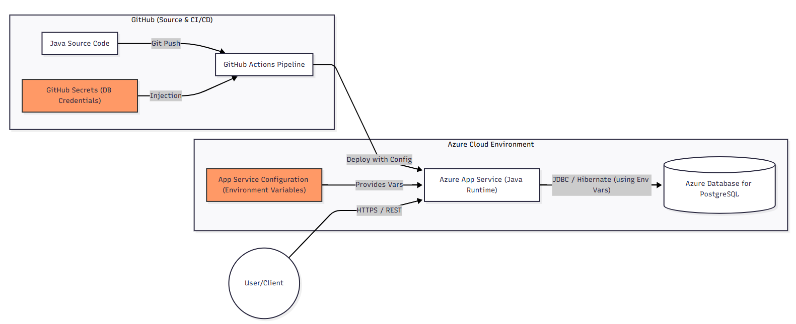
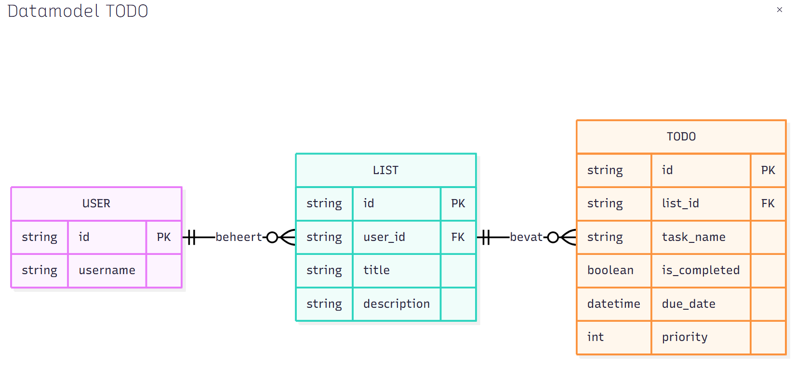

# TODO App - Project Documentatie

Dit project is een Java-gebaseerde TODO applicatie die gebruikmaakt van een PostgreSQL database. De architectuur ondersteunt zowel lokale ontwikkeling als een volledig geautomatiseerde cloud-deployment op Azure.

---

## 1. Architectuur

### Lokale Omgeving
Voor lokale ontwikkeling wordt de Java runtime direct op de machine gedraaid, verbonden met een lokale PostgreSQL instantie.

### Cloud Omgeving (Azure)
In de productieomgeving wordt de applicatie gehost via **Azure App Service** en maakt deze verbinding met een **Azure Database for PostgreSQL**. De deployment wordt afgehandeld door **GitHub Actions**.

---

## 2. Datamodel
Het datamodel is genormaliseerd en bestaat uit drie hoofdentiteiten:

* **USER**: De eigenaar van de lijsten.
* **LIST**: Een verzameling van taken (bijv. "Privé" of "Werk").
* **TODO**: De individuele taken inclusief status, deadline en prioriteit.

---

## 3. API Endpoints (REST)

De API volgt de REST-principes waarbij bronnen hiërarchisch worden benaderd.

### Gebruikers (Users)
| Methode | Endpoint | Beschrijving |
| :--- | :--- | :--- |
| `POST` | `/users` | Maak een nieuwe gebruiker aan |
| `GET` | `/users/{id}` | Haal profielgegevens van een gebruiker op |

### Lijsten (Lists)
| Methode | Endpoint | Beschrijving |
| :--- | :--- | :--- |
| `GET` | `/users/{userId}/lists` | Haal alle lijsten van een specifieke gebruiker op |
| `POST` | `/users/{userId}/lists` | Maak een nieuwe lijst aan voor een gebruiker |
| `PUT` | `/lists/{listId}` | Wijzig de titel of beschrijving van een lijst |
| `DELETE` | `/lists/{listId}` | Verwijder een lijst (en alle bijbehorende taken) |

### Taken (Todos)
| Methode | Endpoint | Beschrijving |
| :--- | :--- | :--- |
| `GET` | `/lists/{listId}/todos` | Haal alle taken binnen een specifieke lijst op |
| `POST` | `/lists/{listId}/todos` | Voeg een nieuwe taak toe aan een lijst |
| `GET` | `/todos/{todoId}` | Haal de details van één specifieke taak op |
| `PUT` | `/todos/{todoId}` | Update een taak (status, deadline, prioriteit, etc.) |
| `DELETE` | `/todos/{todoId}` | Verwijder een taak |

---

## 4. Technologie Stack
* **Backend:** Java met Spring Boot / Hibernate (JPA)
* **Database:** PostgreSQL
* **CI/CD:** GitHub Actions
* **Cloud:** Azure (App Service & Managed PostgreSQL)
* **Communicatie:** JSON via HTTPS / REST

### 1. Architectuurdiagram
Het diagram visualiseert de volledige lifecycle van de code: van **Java Source Code** op GitHub naar een automatische build en deployment via **GitHub Actions**. De applicatie draait in de cloud binnen een **Azure App Service** (Java Runtime), die via **JDBC/Hibernate** communiceert met een beveiligde **Azure Database for PostgreSQL**. De gebruiker communiceert met de API via versleutelde HTTPS/REST-verbindingen.

### 2. API Endpoints
De API maakt gebruik van **RESTful endpoints** met een logische, hiërarchische structuur (bijv. `/users/{id}/lists`). De endpoints ondersteunen volledige CRUD-functionaliteit.

### 3. Datamodel
Het schema is genormaliseerd en bestaat uit drie tabellen met strikte relaties:
* **User (1) -> List (N):** Een gebruiker beheert één of meerdere lijsten.
* **List (1) -> Todo (N):** Elke lijst bevat specifieke taken.
  Integriteit wordt gewaarborgd door **Primary Keys (PK)** en **Foreign Keys (FK)**, waardoor data-consistentie tussen gebruikers en hun taken gegarandeerd is.

### 4. Azure Services
* **Azure App Service:** Gekozen als PaaS (Platform as a Service) oplossing voor eenvoudige schaling en integratie met Java.
* **Azure Database for PostgreSQL:** Een volledig beheerde database die zorgt voor automatische patching, back-ups en hoge beschikbaarheid.
* **GitHub Actions:** Gebruikt om een betrouwbare CI/CD-pipeline op te zetten, wat zorgt voor consistente deployments.

### 5. Security (Secure Software by Design)
De applicatie is gebouwd met beveiliging als uitgangspunt:
* **Environment Variables:** Gevoelige informatie, zoals database-credentials (username/password), wordt **nooit** in de broncode opgeslagen. Deze worden veilig beheerd via Azure App Service Configuration en GitHub Secrets.
* **Least Privilege:** De databasegebruiker heeft enkel de rechten die strikt noodzakelijk zijn voor de applicatie.
* **Defense in Depth:** Gebruik van HTTPS voor data-in-transit en firewalls binnen Azure om de database af te schermen van het publieke internet.
